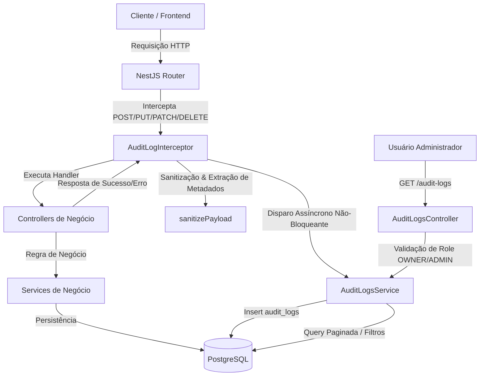

# Logs de Auditoria e Ações do Sistema Design

**Spec**: `.specs/features/logs/spec.md`
**Status**: Approved

---

## Architecture Overview

O sistema de auditoria é estruturado em três camadas complementares e desacopladas:
1. **Camada de Interceptação HTTP Global (`AuditLogInterceptor`)**: Registra de forma transparente todas as mutações da API (`POST`, `PUT`, `PATCH`, `DELETE`), calculando tempo de execução, status HTTP, coletando IP, User-Agent, usuário autenticado e sanitizando os payloads recebidos.
2. **Camada de Serviço de Auditoria (`AuditLogsService`)**: Fornece persistência não-bloqueante no banco de dados via Prisma, isolando eventuais falhas de I/O para que a requisição de negócio nunca seja interrompida, além de disponibilizar queries com paginação e filtros para a API de consulta.
3. **Camada de Exposição e Controle de Acesso (`AuditLogsController`)**: Endpoints protegidos com `JwtAuthGuard` que garantem que apenas administradores da família (`OWNER` ou `ADMIN`) ou o próprio usuário consultem os registros.



---

## Code Reuse Analysis

### Existing Components to Leverage

| Component | Location | How to Use |
| --------- | -------- | ---------- |
| `PrismaService` | `backend/src/prisma/prisma.service.ts` | Injetado no `AuditLogsService` para executar queries e inserts na tabela `audit_logs` |
| `JwtAuthGuard` | `backend/src/common/guards/jwt-auth.guard.ts` | Aplicado no `AuditLogsController` para exigir token JWT válido |
| `GetUser` Decorator | `backend/src/common/decorators/get-user.decorator.ts` | Utilizado nos endpoints de consulta de logs para extrair `userId` |
| Tenancy & Roles Pattern | `backend/src/modules/families/` | Verificação de pertencimento e papel de membro (`OWNER`, `ADMIN`, `MEMBER`) |

### Integration Points

| System | Integration Method |
| ------ | ------------------ |
| `AppModule` | Registro do `AuditLogsModule` e do interceptor global via `APP_INTERCEPTOR` |
| `schema.prisma` | Definição da tabela `audit_logs` e enum `AuditAction` com migração via Prisma Migrate |

---

## Components

### `AuditLogInterceptor`
- **Purpose**: Interceptar todas as requisições HTTP mutativas da API, medir latência, sanitizar o corpo da requisição e acionar o serviço de auditoria sem bloquear a resposta do cliente.
- **Location**: `backend/src/common/interceptors/audit-log.interceptor.ts`
- **Interfaces**:
  - `intercept(context: ExecutionContext, next: CallHandler): Observable<any>`
- **Dependencies**: `AuditLogsService`, `Reflector`
- **Reuses**: NestJS `CallHandler`, `ExecutionContext`, `tap` / `catchError` do RxJS.

### `AuditLogsService`
- **Purpose**: Persistir logs de forma resiliente (try/catch isolado com Logger) e fornecer listagem paginada com filtros seguros de isolamento de tenant.
- **Location**: `backend/src/modules/audit-logs/audit-logs.service.ts`
- **Interfaces**:
  - `createLog(data: CreateAuditLogInput): Promise<void>` - Gravação segura não-bloqueante
  - `findAll(userId: string, query: FindAuditLogsQueryDto): Promise<{ data: AuditLog[], meta: PaginationMeta }>`
  - `findById(userId: string, id: string): Promise<AuditLog>`
- **Dependencies**: `PrismaService`
- **Reuses**: Padrão de paginação e filtragem existente no sistema.

### `AuditLogsController`
- **Purpose**: Expor endpoints REST para consulta dos registros de auditoria por gestores autorizados.
- **Location**: `backend/src/modules/audit-logs/audit-logs.controller.ts`
- **Interfaces**:
  - `GET /audit-logs`: Listagem com filtros por `familyId`, `userId`, `entityName`, `action`, `startDate`, `endDate`, `page`, `limit`.
  - `GET /audit-logs/:id`: Detalhe do log de auditoria.
- **Dependencies**: `AuditLogsService`, `PrismaService`
- **Reuses**: `JwtAuthGuard`, `@GetUser`, Swagger decorators.

### Sanitizer Utility (`sanitizePayload`)
- **Purpose**: Função utilitária pura que percorre recursivamente objetos/arrays e substitui dados sensíveis por `[REDACTED]`.
- **Location**: `backend/src/common/utils/sanitizer.util.ts`
- **Interfaces**:
  - `sanitizePayload(payload: any): any`
- **Sensíveis mascarados**: `password`, `passwordHash`, `token`, `refreshToken`, `secret`, `creditCardNumber`, `cvv`, `authorization`.

---

## Data Models

### Prisma Schema (`schema.prisma`)

```prisma
enum AuditAction {
  CREATE
  UPDATE
  DELETE
  RESTORE
  LOGIN
  LOGOUT
  OTHER
}

model AuditLog {
  id           String       @id @default(uuid()) @db.Uuid
  userId       String?      @map("user_id") @db.Uuid
  familyId     String?      @map("family_id") @db.Uuid
  entityName   String?      @map("entity_name") @db.VarChar(50)
  entityId     String?      @map("entity_id") @db.Uuid
  action       AuditAction  @default(OTHER)
  method       String       @db.VarChar(10)
  endpoint     String       @db.VarChar(255)
  ipAddress    String?      @map("ip_address") @db.VarChar(45)
  userAgent    String?      @map("user_agent") @db.VarChar(255)
  statusCode   Int?         @map("status_code") @db.SmallInt
  durationMs   Int?         @map("duration_ms") @db.Integer
  oldData      Json?        @map("old_data") @db.JsonB
  newData      Json?        @map("new_data") @db.JsonB
  metadata     Json?        @db.JsonB
  createdAt    DateTime     @default(now()) @map("created_at") @db.Timestamptz

  user         User?        @relation(fields: [userId], references: [id], onDelete: SetNull)
  family       Family?      @relation(fields: [familyId], references: [id], onDelete: SetNull)

  @@index([userId, createdAt])
  @@index([familyId, createdAt])
  @@index([entityName, entityId])
  @@index([action, createdAt])
  @@map("audit_logs")
}
```

---

## Error Handling Strategy

| Error Scenario | Handling | User Impact |
| -------------- | -------- | ----------- |
| Falha de conexão ou timeout ao gravar em `audit_logs` | `AuditLogsService` captura a exceção em bloco try/catch e loga com `Logger.error` sem propagar | Nenhum. A resposta da transação do usuário é retornada normalmente com sucesso |
| Usuário não autenticado tentando acessar `GET /audit-logs` | `JwtAuthGuard` intercepta e retorna `401 Unauthorized` | Requisição bloqueada com mensagem padronizada |
| Usuário comum tentando ver logs de família onde não é `OWNER`/`ADMIN` | Controller valida membresia e lança `ForbiddenException(403)` | Usuário recebe erro de permissão insuficiente |
| Payload recebido na requisição com circularidade ou formato inválido | Sanitizer possui guarda para tipos primitivos, nulos e circularidade | Payload tratado com segurança sem quebra de execução |

---

## Risks & Concerns

| Concern | Location (file:line) | Impact | Mitigation |
| ------- | -------------------- | ------ | ---------- |
| Degradação de performance em rotas de alta frequência | `audit-log.interceptor.ts` | Aumento potencial de latência se a gravação fosse síncrona | A gravação no banco é executada assincronamente (sem aguardar promise no `tap` de resposta) e protegida contra uncaught promises |
| Vazamento acidental de senhas em endpoints de login ou troca de senha | `backend/src/modules/auth/` | Riscos de segurança e compliance | Sanitização em múltiplos níveis: verificação recursiva por chaves conhecidas (`password`, `token`, etc.) |
| Crescimento excessivo da tabela `audit_logs` | PostgreSQL `audit_logs` | Uso contínuo de disco | Apenas métodos mutativos (`POST`, `PUT`, `PATCH`, `DELETE`) são logados; `GET` é descartado |

---

## Tech Decisions

| Decision | Choice | Rationale |
| -------- | ------ | --------- |
| Gravação de logs assíncrona não-bloqueante | Promise sem await no interceptor com catch isolado | Garante tempo de resposta mínimo para o usuário final e desacopla a auditoria da disponibilidade imediata do banco |
| Armazenamento de payloads em JSONB | Coluna `new_data` e `old_data` como `JsonB` no PostgreSQL | Permite armazenar qualquer estrutura de dados com indexação flexível e sem esquema rígido |
| Controle de Acesso aos Logs | Baseado nos papéis `OWNER` e `ADMIN` de `FamilyMember` | Alinha-se diretamente com a decisão AD-003 de Tenancy dual e RBAC já em vigor |

> **Decisão de Projeto**: Registrar como `AD-011` em `.specs/STATE.md`: Implementar arquitetura de logs de auditoria via tabela `audit_logs` com interceptor global assíncrono e sanitização obrigatória de dados sensíveis.
