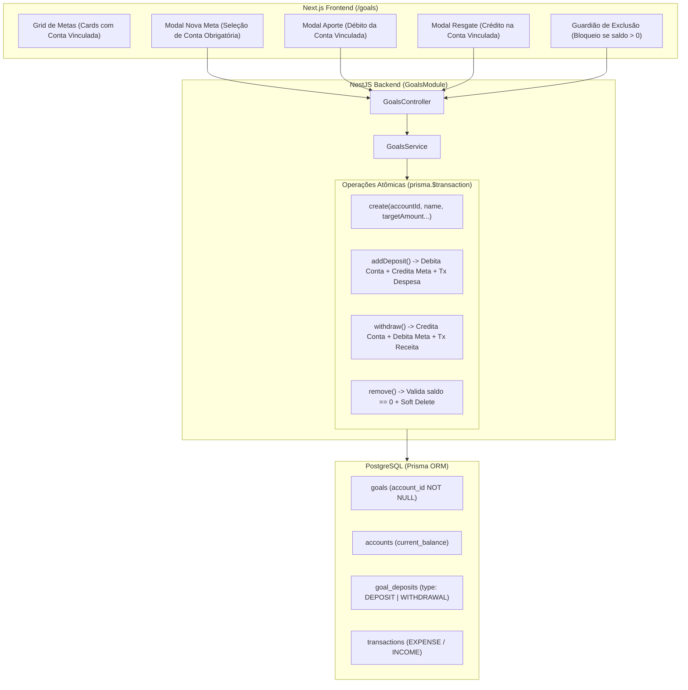

# Metas Financeiras: Vínculo Obrigatório a Contas (Cofrinhos) e Resgate Design

**Spec**: `.specs/features/metas-vinculo-conta-e-resgate/spec.md`
**Status**: Draft

---

## Architecture Overview

O design adota o padrão de "Cofrinhos / Caixinhas", no qual uma Meta Financeira é uma extensão com custódia atrelada a uma Conta Bancária (`Account`). As movimentações de capital (Aportes e Resgates) são integradas diretamente ao saldo da conta e registradas no extrato de transações de forma atômica (`prisma.$transaction`).



---

## Code Reuse Analysis

### Existing Components to Leverage

| Component | Location | How to Use |
| --------- | -------- | ---------- |
| `GoalsService` | `backend/src/modules/goals/goals.service.ts` | Expandir com método `withdraw()`, proteger `remove()` e vincular `accountId` no `create()` |
| `GoalsController` | `backend/src/modules/goals/goals.controller.ts` | Adicionar endpoint `POST :id/withdraw` e tipar novos DTOs |
| `prisma.$transaction` | `backend/src/prisma/prisma.service.ts` | Assegurar integridade ACID no resgate e no estorno de saldos |
| `AppShell` & UI Base | `frontend/src/app/goals/page.tsx` | Reutilizar modais, formulários, paleta Dark Emerald/Slate e ícones Lucide |
| `formatCurrency`, `formatDate` | `frontend/src/lib/formatters.ts` | Formatação padronizada em pt-BR de moedas e datas |

### Integration Points

| System | Integration Method |
| ------ | ------------------ |
| `Account` Model | Relacionamento 1:N entre `Account` e `Goal` (`Goal.accountId -> Account.id`) |
| `Transaction` Model | Criação de transação `INCOME` na conta vinculada sob categoria "Resgate de Meta" |
| `AuditLogInterceptor` | Rastreabilidade automática de `POST /goals/:id/withdraw` e bloqueios de delete |

---

## Components

### GoalsService

- **Purpose**: Orquestrar as operações de ciclo de vida, aportes, resgates e validações contábeis de metas.
- **Location**: `backend/src/modules/goals/goals.service.ts`
- **Interfaces**:
  - `create(userId: string, dto: CreateGoalDto): Promise<Goal>` - Exige `accountId` válido e autorizado.
  - `addDeposit(userId: string, goalId: string, dto: CreateDepositDto): Promise<GoalDeposit>` - Debita da conta vinculada da meta.
  - `withdraw(userId: string, goalId: string, dto: CreateWithdrawalDto): Promise<GoalDeposit>` - Credita na conta vinculada e subtrai da meta.
  - `remove(userId: string, id: string): Promise<{ message: string }>` - Bloqueia se `currentAmount > 0`.
- **Dependencies**: `PrismaService`
- **Reuses**: Padrões de transação ACID existentes no `addDeposit()` e `TransactionsService`.

### GoalsController

- **Purpose**: Expor endpoints REST com autenticação e validação para metas.
- **Location**: `backend/src/modules/goals/goals.controller.ts`
- **Interfaces**:
  - `POST /goals` - Cria meta com conta vinculada.
  - `POST /goals/:id/deposits` - Registra aporte.
  - `POST /goals/:id/withdraw` - Registra resgate.
  - `DELETE /goals/:id` - Remove meta (com guard de saldo).
- **Dependencies**: `GoalsService`

### GoalsPage (Frontend)

- **Purpose**: Interface de gestão de metas, aportes, resgates e visualização de cofrinhos.
- **Location**: `frontend/src/app/goals/page.tsx`
- **Interfaces**: Modais reativos de Criação (com seletor de conta), Aporte, Resgate e Histórico unificado.
- **Dependencies**: `apiRequest`, `useAuth`

---

## Data Models

### Prisma Schema Updates

```prisma
enum GoalMovementType {
  DEPOSIT
  WITHDRAWAL
}

model Goal {
  id            String        @id @default(uuid()) @db.Uuid
  userId        String        @map("user_id") @db.Uuid
  familyId      String?       @map("family_id") @db.Uuid
  accountId     String        @map("account_id") @db.Uuid
  name          String        @db.VarChar(150)
  targetAmount  Decimal       @map("target_amount") @db.Decimal(15, 2)
  currentAmount Decimal       @default(0.00) @map("current_amount") @db.Decimal(15, 2)
  deadline      DateTime?     @db.Date
  status        GoalStatus    @default(IN_PROGRESS)
  color         String?       @db.VarChar(7)
  icon          String?       @db.VarChar(50)
  createdAt     DateTime      @default(now()) @map("created_at") @db.Timestamptz
  deletedAt     DateTime?     @map("deleted_at") @db.Timestamptz

  user          User          @relation(fields: [userId], references: [id], onDelete: Cascade)
  family        Family?       @relation(fields: [familyId], references: [id], onDelete: Cascade)
  account       Account       @relation(fields: [accountId], references: [id], onDelete: Restrict)
  deposits      GoalDeposit[]

  @@index([userId, deletedAt])
  @@index([familyId, deletedAt])
  @@index([accountId, deletedAt])
  @@map("goals")
}

model GoalDeposit {
  id            String            @id @default(uuid()) @db.Uuid
  goalId        String            @map("goal_id") @db.Uuid
  transactionId String?           @map("transaction_id") @db.Uuid
  type          GoalMovementType  @default(DEPOSIT)
  amount        Decimal           @db.Decimal(15, 2)
  depositDate   DateTime          @map("deposit_date") @db.Date
  notes         String?           @db.Text
  createdAt     DateTime          @default(now()) @map("created_at") @db.Timestamptz

  goal          Goal              @relation(fields: [goalId], references: [id], onDelete: Cascade)
  transaction   Transaction?      @relation(fields: [transactionId], references: [id], onDelete: SetNull)

  @@map("goal_deposits")
}
```

---

## Error Handling Strategy

| Error Scenario | Handling | User Impact |
| -------------- | -------- | ----------- |
| Tentativa de excluir meta com `currentAmount > 0` | Backend lança `BadRequestException('Não é possível excluir uma meta com saldo acumulado. Realize o resgate do valor antes de excluir.')` | Toast/Alerta de erro claro e botão de exclusão protegido no frontend |
| Resgate com valor maior que o saldo acumulado | Backend lança `BadRequestException('Saldo insuficiente na meta para realizar o resgate.')` | Formulário valida e impede submissão no cliente e exibe mensagem amigável |
| Resgate com valor <= 0 | Backend lança `BadRequestException('O valor do resgate deve ser maior que zero.')` | Mensagem de validação de formulário no modal |
| Criação de meta sem conta bancária | DTO valida `@IsUUID() accountId` e lança `BadRequestException` | Campo obrigatório no modal com mensagem de seleção obrigatória |

---

## Risks & Concerns

| Concern | Location (file:line) | Impact | Mitigation |
| ------- | -------------------- | ------ | ---------- |
| Existência de metas antigas no banco sem `account_id` | `backend/prisma/schema.prisma:310` | Falha de integridade relacional ao aplicar migration NOT NULL | Script de migração associa metas legadas à primeira conta ativa do usuário correspondente |
| Concorrência em múltiplos resgates simultâneos | `backend/src/modules/goals/goals.service.ts:99` | Risco de saldo da meta ficar negativo | `prisma.$transaction` com verificação estrita do saldo atual dentro do lock transacional |
| Transição de status da meta | `backend/src/modules/goals/goals.service.ts:183` | Meta com status COMPLETED mantendo status após resgate | Se `currentAmount.lt(targetAmount)`, redefinir `status = GoalStatus.IN_PROGRESS` |

---

## Tech Decisions

| Decision | Choice | Rationale |
| -------- | ------ | --------- |
| Modelo de Custódia | Meta como Cofrinho vinculado a 1 Conta Fixa | Reflete a realidade de caixinhas bancárias (Nubank/Inter) e garante destino unívoco dos recursos |
| Guard de Exclusão | Bloqueio estrito até zerar saldo via resgate manual | Evita exclusões precipitadas com perda de rastreabilidade ou resgates forçados indesejados |
| Tabela de Movimentações | Evoluir `GoalDeposit` com enum `type: DEPOSIT \| WITHDRAWAL` | Mantém compatibilidade com histórico existente e evita criar tabelas redundantes |
| Registro no Extrato Bancário | Transação `INCOME` na conta vinculada ("Resgate de Meta") | Garante conciliação precisa no saldo bancário e histórico claro no extrato |
