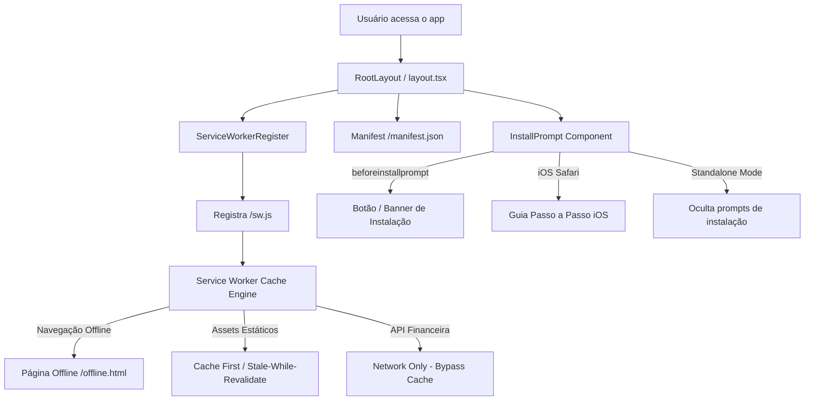

# PWA (Progressive Web App) Design

**Spec**: `.specs/features/pwa-installable-app/spec.md`
**Status**: Approved

---

## Architecture Overview

A arquitetura PWA do Finanças Familiar é projetada para fornecer uma experiência nativa de aplicativo no celular e desktop, permitindo que a aplicação seja instalada e executada em modo standalone, sem interferir no build Docker ou na integridade das operações financeiras.

### Princípios Chave

1. **Zero Impacto no Build Standalone**: Service Worker e manifesto servidos nativamente via diretório `public/` e Next.js metadata, mantendo total compatibilidade com `output: 'standalone'` e o Dockerfile de produção.
2. **Segurança e Consistência Contábil**: Requisições de mutação e endpoints de API financeira nunca utilizam cache offline cego para evitar saldos divergentes ou transações fantasma.
3. **Resiliência Offline**: Se a conexão falhar ou o dispositivo estiver sem internet, o Service Worker intercepta a navegação e exibe uma tela amigável de offline (`offline.html`) estilizada com a identidade escura do sistema (Slate 950).
4. **Instalabilidade Universal**: Atende 100% dos requisitos do Chrome Installability Criteria e fornece suporte completo para iOS WebClip (Apple Mobile Web App).

---

## Code Reuse Analysis

### Existing Components to Leverage

| Component | Location | How to Use |
| --------- | -------- | ---------- |
| `layout.tsx` | `frontend/src/app/layout.tsx` | Injeção de metadados PWA, viewport theme-color, manifest link e montagem dos componentes de PWA |
| `logo.png` | `frontend/public/logo.png` | Fonte de imagem em alta resolução (1024x826) para derivar ícones PWA de 192x192, 512x512, maskable e apple-touch-icon |
| `Sidebar` / Header | `frontend/src/app/page.tsx` e layout shell | Ponto de ancoragem para o botão e banner de instalação |
| Tailwind CSS | `frontend/src/app/globals.css` | Paleta Slate e design escuro reaproveitados nos componentes visuais |

---

## Component Specifications

### 1. Manifesto Web App (`frontend/public/manifest.json`)
- **Propriedades**:
  - `id`: `/`
  - `name`: `Finanças Familiar - Gestão Financeira`
  - `short_name`: `Finanças`
  - `description`: `Controle integrado de contas, cartões, orçamentos e metas familiares`
  - `start_url`: `/`
  - `scope`: `/`
  - `display`: `standalone`
  - `orientation`: `portrait-primary`
  - `background_color`: `#020617`
  - `theme_color`: `#020617`
  - `icons`:
    - `src`: `/icons/icon-192x192.png`, `sizes`: `192x192`, `type`: `image/png`, `purpose`: `any`
    - `src`: `/icons/icon-512x512.png`, `sizes`: `512x512`, `type`: `image/png`, `purpose`: `any`
    - `src`: `/icons/maskable-icon-512x512.png`, `sizes`: `512x512`, `type`: `image/png`, `purpose`: `maskable`
    - `src`: `/icons/apple-touch-icon.png`, `sizes`: `180x180`, `type`: `image/png`, `purpose`: `any`

### 2. Service Worker (`frontend/public/sw.js`)
- **Versionamento de Cache**: `CACHE_NAME = 'financas-familiar-v1'`
- **Ciclo de Vida**:
  - `install`: Pré-armazena `/offline.html`, `/manifest.json` e ícones principais. Chama `self.skipWaiting()`.
  - `activate`: Remove caches legados que não correspondam à versão ativa. Chama `self.clients.claim()`.
  - `fetch`:
    - Requisições que não sejam `GET` ignoradas.
    - Se a URL contiver `/api/` ou apontar para backend (`:3001`), executa bypass direto (Network Only).
    - Se for requisição de navegação (`request.mode === 'navigate'`): tenta Network; se falhar, retorna resposta em cache ou a página `/offline.html`.
    - Se for asset estático (`/icons/`, `favicon.ico`, `logo.png`): Stale-While-Revalidate.

### 3. Página Offline (`frontend/public/offline.html`)
- Página HTML estática independente, sem dependência de JavaScript de terceiros, com identidade visual em Tailwind/Dark Slate `#020617`, ícone informativo, mensagem em português indicando ausência de conexão e botão "Tentar novamente" (`window.location.reload()`).

### 4. Componente de Registro (`frontend/src/components/pwa/ServiceWorkerRegister.tsx`)
- Componente cliente (`'use client'`) montado no `layout.tsx`.
- Verifica se `'serviceWorker' in navigator` e registra `/sw.js` com escopo `/`.
- Escuta atualizações do Service Worker de forma silenciosa e resiliente.

### 5. Componente de Prompt de Instalação (`frontend/src/components/pwa/InstallPrompt.tsx`)
- Componente cliente (`'use client'`) montado no layout global ou barra superior.
- Detecta se já está em execução standalone (`window.matchMedia('(display-mode: standalone)').matches || navigator.standalone`).
- Se não estiver em standalone:
  - No Chrome/Edge/Android: captura o evento `beforeinstallprompt`, previne o comportamento padrão e exibe botão estilizado "Instalar App" / banner descartável.
  - Ao clicar: invoca `deferredPrompt.prompt()` e trata o resultado (`accepted` / `dismissed`).
  - No iOS Safari: exibe botão discreto "Como instalar" que abre modal/tooltip didático com o passo a passo nativo da Apple ("Compartilhar" -> "Adicionar à Tela de Início").

---

## Risks & Concerns

| Risk / Concern | Mitigation |
| -------------- | ---------- |
| Dados financeiros dessincronizados por cache incorreto no Service Worker | Regra estrita no Service Worker: nenhuma requisição de API ou mutação financeira é colocada em cache; somente assets estáticos e fallback de navegação offline são cacheados |
| Prompt de instalação aparecendo repetidamente e incomodando o usuário | Salva no `localStorage` a preferência de descarte temporário caso o usuário recuse o banner, além de ocultar automaticamente em modo standalone |
| Ícones cortados ou distorcidos no Android ou iOS | Geração automatizada de ícones perfeitamente quadrados com canvas proporcional e ícone com safe-zone de 20% para a versão `maskable` |
| Falha de Service Worker em desenvolvimento | Tratamento seguro de exceções com fallback silencioso para que o desenvolvimento e testes locais continuem funcionando mesmo sem HTTPS |
