# Sistema Financeiro Pessoal e Familiar - Architecture & Technical Design

**Spec**: `.specs/features/sistema-financeiro-mvp/spec.md`
**Status**: Approved

---

## Architecture Overview

O sistema é construído como um Monolito Modular Desacoplado (Decoupled Client-Server Monorepo):
- **Backend**: NestJS (TypeScript) estruturado em módulos de domínio independentes, Prisma ORM com PostgreSQL 16+, autenticação JWT com Passport.js, e validação declarativa com `class-validator`.
- **Frontend**: Next.js 14+ (App Router, Server Components + Client Components interativos), Tailwind CSS, Lucide Icons, e Recharts para visualizações analíticas de fluxo financeiro.
- **Ambiente & Infraestrutura**: Docker Compose orquestrando containers de banco de dados (`postgres`), backend API (`api`) e frontend (`frontend`).

```mermaid
flowchart TD
    subgraph Client["Cliente / Navegador"]
        User["Usuário"]
    end

    subgraph DockerCompose["Ambiente Conteinerizado (Docker Compose)"]
        subgraph FrontendLayer["Frontend (Next.js 14+ App Router - Porta 3000)"]
            UIAuth["/login, /register"]
            UIDash["/dashboard (Visão Geral & Gráficos)"]
            UITrans["/transactions (Extrato, Filtros, Modal Lançamento)"]
            UIAccts["/accounts (Contas Bancárias & Carteiras)"]
            UICards["/cards (Cartões & Faturas)"]
            UIBudgets["/budgets (Orçamentos & Alertas)"]
            UIGoals["/goals (Metas & Aportes)"]
            UIFamily["/family (Gestão de Membros & Convites)"]
            UIReports["/reports (Exportação CSV/XLSX)"]
        end

        subgraph BackendLayer["Backend API (NestJS - Porta 3001)"]
            AuthMod["AuthModule (JWT, Passport, Bcrypt)"]
            UserMod["UsersModule"]
            FamilyMod["FamiliesModule (RBAC)"]
            AcctMod["AccountsModule"]
            CardMod["CreditCardsModule (Faturas & Ciclos)"]
            CatMod["CategoriesModule (Padrão & Custom)"]
            TxMod["TransactionsModule (Atomic Balances, Parcelas, Recorrências)"]
            BudgetMod["BudgetsModule (Alertas de Teto)"]
            GoalMod["GoalsModule (Aportes & Progresso)"]
            ReportMod["ReportsModule (Agregações & Exportadores)"]
            PrismaSvc["PrismaService (Client & Transactions)"]
        end

        subgraph DataLayer["Banco de Dados (Porta 5432)"]
            PostgresDB[("PostgreSQL 16\n- Decimal(15,2)\n- Relacionamentos Relacionais\n- Índices Otimizados")]
        end
    end

    User -->|HTTP 3000| FrontendLayer
    FrontendLayer -->|REST API Calls / HTTP 3001| BackendLayer
    BackendLayer -->|Prisma Connection Pool| PostgresDB
```

---

## Code Reuse Analysis

### Existing Components & Patterns to Leverage

| Component / Layer | Location | How to Use |
| ----------------- | -------- | ---------- |
| `PrismaService` | `backend/src/prisma/prisma.service.ts` | Prover conexão centralizada e ciclo de vida do Prisma Client |
| `JwtAuthGuard` & `RolesGuard` | `backend/src/common/guards/` | Proteger rotas autenticadas e validar permissões familiares |
| `DecimalHelper` / Monetary math | `backend/src/common/utils/decimal.util.ts` | Assegurar cálculos exatos sem ponto flutuante |
| `ApiClient` / Fetch wrapper | `frontend/src/lib/api.ts` | Centralizar chamadas HTTP com cabeçalhos de autenticação e tratamento de erros |
| `FormatCurrency` / Date formatters | `frontend/src/lib/formatters.ts` | Formatação padrão brasileira (BRL, datas pt-BR) |

### Integration Points

| System | Integration Method |
| ------ | ------------------ |
| `Next.js` ↔ `NestJS API` | Chamadas REST via `fetch` autenticado com Bearer JWT no header `Authorization` |
| `NestJS API` ↔ `PostgreSQL` | Conexão TCP via Prisma Client (`DATABASE_URL`) com migrations automáticas |
| `Export Service` ↔ `Client` | Stream de buffers gerados por bibliotecas de CSV (`json2csv`) e Excel (`exceljs` ou `xlsx`) |

---

## Components & Modules

### Backend Modules (NestJS)

1. **`AuthModule` & `UsersModule`**
   - **Purpose**: Cadastro de usuários, hash seguro de senhas com bcrypt, geração/validação de JWT tokens e gestão de perfis.
   - **Location**: `backend/src/modules/auth/`, `backend/src/modules/users/`
   - **Endpoints**: `POST /auth/register`, `POST /auth/login`, `POST /auth/refresh`, `GET /auth/me`.

2. **`FamiliesModule`**
   - **Purpose**: Gestão de grupos familiares, associação de membros com papéis (`OWNER`, `ADMIN`, `MEMBER`, `VIEWER`), convites e alternância de contexto.
   - **Location**: `backend/src/modules/families/`
   - **Endpoints**: `POST /families`, `GET /families/current`, `POST /families/members`, `DELETE /families/members/:id`.

3. **`AccountsModule`**
   - **Purpose**: CRUD de contas bancárias e carteiras de dinheiro, controle de saldo atual e arquivamento.
   - **Location**: `backend/src/modules/accounts/`
   - **Endpoints**: `GET /accounts`, `POST /accounts`, `PUT /accounts/:id`, `PATCH /accounts/:id/archive`, `DELETE /accounts/:id`.

4. **`CreditCardsModule`**
   - **Purpose**: Gestão de cartões de crédito, limites, geração automática de faturas mensais (`credit_card_invoices`) por ciclo de fechamento/vencimento e liquidação de faturas.
   - **Location**: `backend/src/modules/credit-cards/`
   - **Endpoints**: `GET /credit-cards`, `POST /credit-cards`, `GET /credit-cards/:id/invoices`, `POST /credit-cards/invoices/:id/pay`.

5. **`CategoriesModule`**
   - **Purpose**: Gestão de categorias e subcategorias hierárquicas com ícones/cores e seed inicial de categorias padrão do sistema.
   - **Location**: `backend/src/modules/categories/`
   - **Endpoints**: `GET /categories`, `POST /categories`, `PUT /categories/:id`, `DELETE /categories/:id`.

6. **`TransactionsModule`**
   - **Purpose**: Registro de receitas, despesas, transferências entre contas, parcelamentos com grupos de parcelas e recorrências com atualização atômica de saldos.
   - **Location**: `backend/src/modules/transactions/`
   - **Endpoints**: `GET /transactions`, `POST /transactions`, `PUT /transactions/:id`, `DELETE /transactions/:id`, `POST /transactions/transfer`.

7. **`BudgetsModule`**
   - **Purpose**: Definição de limites mensais por categoria, cálculo de percentual consumido em tempo real e geração de alertas de estouro.
   - **Location**: `backend/src/modules/budgets/`
   - **Endpoints**: `GET /budgets`, `POST /budgets`, `PUT /budgets/:id`, `DELETE /budgets/:id`.

8. **`GoalsModule`**
   - **Purpose**: Cadastro de metas financeiras de economia/investimento, histórico de aportes e cálculo de evolução percentual.
   - **Location**: `backend/src/modules/goals/`
   - **Endpoints**: `GET /goals`, `POST /goals`, `POST /goals/:id/deposits`, `PUT /goals/:id`, `DELETE /goals/:id`.

9. **`ReportsModule`**
   - **Purpose**: Agregação de dados para os dashboards (cards de saldo, receitas/despesas, fluxo mensal, despesas por categoria) e geração de arquivos exportáveis (CSV/Excel).
   - **Location**: `backend/src/modules/reports/`
   - **Endpoints**: `GET /reports/dashboard`, `GET /reports/categories`, `GET /reports/cash-flow`, `GET /reports/export`.

---

### Frontend Pages & Components (Next.js)

1. **`Auth Layout & Pages`** (`/login`, `/register`): Telas elegantes com validação de formulários, persistência de tokens e redirecionamento de rotas.
2. **`App Shell & Sidebar`**: Navegação moderna com alternador de contexto (Minhas Finanças vs. Família), indicadores de usuário e links para todos os módulos.
3. **`Dashboard`** (`/` ou `/dashboard`): Métricas em tempo real, cards de resumo financeiro, gráfico de rosca de categorias e gráfico de barras de receitas vs. despesas.
4. **`Transactions`** (`/transactions`): Extrato paginado com filtros avançados (busca textual, data, categoria, conta, status), modal para novo lançamento (Receita, Despesa, Transferência, Parcelado) e ações de edição/estorno.
5. **`Accounts & Cards`** (`/accounts`, `/cards`): Listagem visual de cartões bancários com barras de limite de crédito, faturas abertas e fechadas, e saldo por conta.
6. **`Budgets & Goals`** (`/budgets`, `/goals`): Barras de progresso com alertas visuais de teto orçamentário e cards de metas com botão de aporte rápido.
7. **`Reports & Export`** (`/reports`): Filtros analíticos com botões de download direto para CSV e Excel.

---

## Data Models & Schema

O banco de dados utiliza o schema relacional PostgreSQL modelado via Prisma:
- `User`: `id`, `name`, `email`, `passwordHash`, `avatarUrl`, `createdAt`, `updatedAt`
- `Family`: `id`, `name`, `description`, `ownerId`, `createdAt`, `updatedAt`
- `FamilyMember`: `id`, `familyId`, `userId`, `role` (`OWNER`, `ADMIN`, `MEMBER`, `VIEWER`), `joinedAt`
- `Account`: `id`, `userId`, `familyId`, `name`, `type` (`CHECKING`, `SAVINGS`, `INVESTMENT`, `CASH`, `OTHER`), `initialBalance`, `currentBalance`, `currency`, `color`, `icon`, `isActive`, `isArchived`
- `CreditCard`: `id`, `userId`, `familyId`, `accountId`, `name`, `brand`, `creditLimit`, `closingDay`, `dueDay`, `color`, `isActive`
- `CreditCardInvoice`: `id`, `creditCardId`, `referenceMonth`, `closingDate`, `dueDate`, `status` (`OPEN`, `CLOSED`, `PAID`, `OVERDUE`), `totalAmount`, `paidAmount`, `paidAt`
- `Category`: `id`, `userId`, `familyId`, `parentId`, `name`, `type` (`INCOME`, `EXPENSE`), `icon`, `color`, `isSystemDefault`
- `Transaction`: `id`, `userId`, `familyId`, `accountId`, `destinationAccountId`, `creditCardId`, `invoiceId`, `categoryId`, `recurrenceId`, `type` (`INCOME`, `EXPENSE`, `TRANSFER`), `amount`, `description`, `notes`, `transactionDate`, `status` (`PENDING`, `COMPLETED`, `CANCELLED`), `isPrivate`, `installmentNumber`, `totalInstallments`, `installmentGroupId`
- `Recurrence`: `id`, `userId`, `familyId`, `accountId`, `categoryId`, `type`, `amount`, `description`, `frequency` (`DAILY`, `WEEKLY`, `MONTHLY`, `YEARLY`), `startDate`, `endDate`, `autoConfirm`, `isActive`
- `Budget`: `id`, `familyId`, `userId`, `categoryId`, `periodMonth`, `targetAmount`, `alertPercentage`
- `Goal`: `id`, `userId`, `familyId`, `name`, `targetAmount`, `currentAmount`, `deadline`, `status` (`IN_PROGRESS`, `COMPLETED`, `PAUSED`), `color`, `icon`
- `GoalDeposit`: `id`, `goalId`, `transactionId`, `amount`, `depositDate`, `notes`

---

## Error Handling Strategy

| Error Scenario | Handling | User Impact |
| -------------- | -------- | ----------- |
| Falha de autenticação ou token expirado | `UnauthorizedException` (401) com interceptor no frontend | Redirecionamento amigável para tela de login com toast informativo |
| Violação de regras de permissão (ex: viewer tentando deletar) | `ForbiddenException` (403) via `RolesGuard` | Alerta visual de permissão insuficiente |
| Tentativa de excluir categoria ou conta com lançamentos | `BadRequestException` (400) com mensagem amigável | Modal instrutivo sugerindo arquivamento ou reclassificação |
| Erro de concorrência ou falha em transação bancária | Rollback automático via `prisma.$transaction` e `InternalServerErrorException` (500) | Notificação de erro sem corrupção de dados ou saldos parciais |
| Validação de payload inválido (campos vazios, tipos incorretos) | `ValidationPipe` do NestJS gerando status 400 com lista de campos | Realce em vermelho dos campos inválidos nos formulários |

---

## Risks & Concerns

| Concern | Location | Impact | Mitigation |
| ------- | -------- | ------ | ---------- |
| Divergência de arredondamento em parcelamentos e faturas | `TransactionsService` & `CreditCardsService` | Perda ou acúmulo de centavos | Ajustar a diferença de centavos na última parcela (ex: 100/3 = 33.33 + 33.33 + 33.34) |
| Vazamento de transações privadas no contexto familiar | `TransactionsService` queries | Violação de privacidade | Aplicar filtro estrito: se `isPrivate = true` e usuário não é o autor, omitir detalhes na consulta |
| Performance em consultas agregadas de dashboard e extratos | `ReportsService` & `TransactionsService` | Lentidão no carregamento | Índices compostos `[userId, transactionDate]`, `[familyId, transactionDate]`, `[accountId, transactionDate]` |

---

## Tech Decisions

| Decision | Choice | Rationale |
| -------- | ------ | --------- |
| Monolito Modular no Backend | NestJS com injeção de dependências | Organização corporativa limpa, separação de módulos por domínio e escalabilidade |
| Interface do Usuário | Next.js 14 App Router + Tailwind CSS + Lucide Icons + Recharts | Renderização rápida, estética moderna e responsiva, e facilidade de manutenção |
| Tratamento de Moeda | `Prisma.Decimal` + formatação BRL | Segurança matemática e conformidade contábil |
| Orquestração de Containers | Docker Compose unificado com PostgreSQL 16 Alpine | Facilidade de execução em 1 comando (`docker compose up -d`) |
