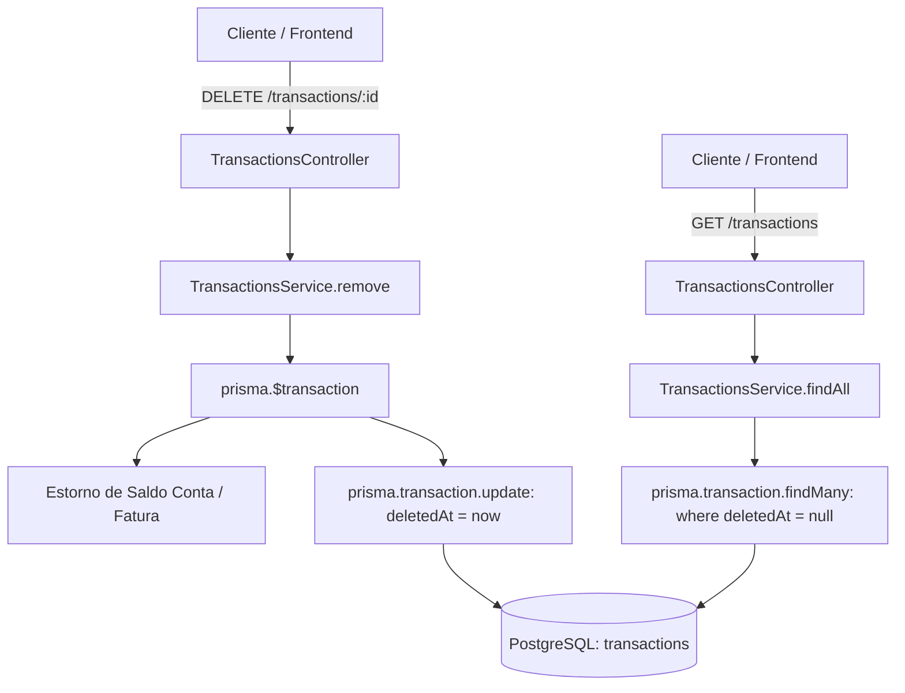

# Soft Delete com deleted_at Design

**Spec**: `.specs/features/soft-delete/spec.md`
**Status**: Approved

---

## Architecture Overview

A arquitetura de Soft Delete adota o padrão de persistência temporal (`deleted_at`), onde registros descartados pelo usuário recebem a data/hora atual e são preservados no PostgreSQL para integridade referencial, conciliação e auditoria contábil.



A estratégia combina:
1. **Schema & Database Layer**: Inclusão de `deletedAt DateTime? @map("deleted_at") @db.Timestamptz` nos modelos `Transaction`, `Account`, `CreditCard`, `Category`, `Goal`, `Budget` e `Person` com índices dedicados/compostos para performance em filtros de registros ativos.
2. **Service Layer**: Substituição explícita de `prisma[model].delete` por `prisma[model].update({ data: { deletedAt: new Date() } })`, garantindo que estornos, auditoria e rollback atômico em `prisma.$transaction` permaneçam 100% determinísticos.
3. **Query & Retrieval Layer**: Adição do predicado `{ deletedAt: null }` em todos os métodos de busca (`findUnique`/`findFirst`, `findMany`), contagens (`count`) e somatórios/agregações (`aggregate`).
4. **Integrity Validation**: Verificações pré-exclusão (ex: exclusão de Conta ou Categoria verificando se há transações ativas) passam a filtrar exclusivamente `deletedAt: null`. Se as transações vinculadas já tiverem sido soft-deleted, a exclusão da entidade pai é autorizada.

---

## Code Reuse Analysis

### Existing Components to Leverage

| Component | Location | How to Use |
| --------- | -------- | ---------- |
| `PrismaService` | `backend/src/prisma/prisma.service.ts` | Injeção de dependência e transações atômicas `$transaction` |
| `TransactionsService` | `backend/src/modules/transactions/transactions.service.ts` | Reuso da lógica de reversão de saldo em contas e abatimento em faturas ao deletar |
| `AccountsService` | `backend/src/modules/accounts/accounts.service.ts` | Reuso das validações de pertencimento e família, aplicando `deletedAt: null` |
| `CategoriesService` | `backend/src/modules/categories/categories.service.ts` | Reuso da validação de categorias do sistema e checagem de transações vinculadas |
| `CreditCardsService` | `backend/src/modules/credit-cards/credit-cards.service.ts` | Reuso do cálculo de faturas abertas e validação de despesas |
| `GoalsService` & `BudgetsService` | `backend/src/modules/goals/` e `backend/src/modules/budgets/` | Reuso da lógica de metas e orçamentos mensais |
| `FamiliesService` | `backend/src/modules/families/families.service.ts` | Reuso da remoção lógica de perfis `Person` vinculados à família |

### Integration Points

| System | Integration Method |
| ------ | ------------------ |
| PostgreSQL Schema | Migração Prisma adicionando `deleted_at TIMESTAMPTZ` e índices em 7 tabelas |
| NestJS Controllers & Services | Métodos `remove` e queries `find*` atualizados |
| Testes Unitários e Integração | Atualização dos mocks do Jest e inclusão de cenários de asserção de `deletedAt` |

---

## Components

### 1. Prisma Schema & Migration
- **Purpose**: Definir o campo `deletedAt` e índices nos 7 modelos relacionais.
- **Location**: `backend/prisma/schema.prisma`
- **Interfaces**:
  - `model Transaction`: `deletedAt DateTime? @map("deleted_at") @db.Timestamptz` + index `[userId, deletedAt]`
  - `model Account`: `deletedAt DateTime? @map("deleted_at") @db.Timestamptz`
  - `model CreditCard`: `deletedAt DateTime? @map("deleted_at") @db.Timestamptz`
  - `model Category`: `deletedAt DateTime? @map("deleted_at") @db.Timestamptz`
  - `model Goal`: `deletedAt DateTime? @map("deleted_at") @db.Timestamptz`
  - `model Budget`: `deletedAt DateTime? @map("deleted_at") @db.Timestamptz`
  - `model Person`: `deletedAt DateTime? @map("deleted_at") @db.Timestamptz`

### 2. Transactions Module
- **Purpose**: Gerenciar ciclo de vida de transações com exclusão lógica e estorno de saldo.
- **Location**: `backend/src/modules/transactions/transactions.service.ts`
- **Interfaces**:
  - `remove(id: string, user: CurrentUser): Promise<{ message: string }>`:
    - Busca a transação garantindo que `deletedAt: null`. Se não existir ou já estiver deletada, lança `NotFoundException`.
    - Executa estorno de saldo na conta ou fatura.
    - Executa `tx.transaction.update({ where: { id }, data: { deletedAt: new Date() } })`.
  - `findAll(...)`: adiciona `deletedAt: null` na cláusula `where`.
  - `findOne(...)`: adiciona `deletedAt: null`.

### 3. Accounts Module
- **Purpose**: Gestão de contas bancárias com exclusão lógica e integridade referencial de transações.
- **Location**: `backend/src/modules/accounts/accounts.service.ts`
- **Interfaces**:
  - `remove(id: string, user: CurrentUser)`:
    - Checa se existem transações com `{ accountId: id, deletedAt: null }`. Se houver, bloqueia com `BadRequestException`.
    - Executa `account.update({ where: { id }, data: { deletedAt: new Date(), isActive: false } })`.
  - `findAll(...)` / `findOne(...)`: filtra `deletedAt: null`.

### 4. Credit Cards Module
- **Purpose**: Gestão de cartões de crédito com exclusão lógica.
- **Location**: `backend/src/modules/credit-cards/credit-cards.service.ts`
- **Interfaces**:
  - `remove(id: string, user: CurrentUser)`:
    - Checa se existem despesas ativas vinculadas com `{ creditCardId: id, deletedAt: null }`.
    - Executa `creditCard.update({ where: { id }, data: { deletedAt: new Date(), isActive: false } })`.
  - `findAll(...)` / `findOne(...)`: filtra `deletedAt: null`.

### 5. Categories Module
- **Purpose**: Gestão de categorias com exclusão lógica.
- **Location**: `backend/src/modules/categories/categories.service.ts`
- **Interfaces**:
  - `remove(id: string, user: CurrentUser)`:
    - Checa se existem transações ativas com `{ categoryId: id, deletedAt: null }`. Se houver, bloqueia.
    - Executa `category.update({ where: { id }, data: { deletedAt: new Date() } })`.
  - `findAll(...)` / `findOne(...)`: filtra `deletedAt: null`.

### 6. Goals & Budgets Modules
- **Purpose**: Gestão de metas e orçamentos com exclusão lógica.
- **Location**: `backend/src/modules/goals/goals.service.ts` e `backend/src/modules/budgets/budgets.service.ts`
- **Interfaces**:
  - `remove(...)`: atualiza `deletedAt = new Date()`.
  - `findAll(...)` / `findOne(...)`: filtra `deletedAt: null`.

### 7. Families Module (Person entity)
- **Purpose**: Gestão de pessoas/dependentes na família com exclusão lógica.
- **Location**: `backend/src/modules/families/families.service.ts`
- **Interfaces**:
  - `removePerson(familyId: string, personId: string, user: CurrentUser)`:
    - Executa `tx.person.update({ where: { id: personId }, data: { deletedAt: new Date() } })`.
  - `getPeople(...)` / `getFamily(...)`: inclui apenas pessoas onde `deletedAt: null`.

---

## Data Models

Exemplo do modelo `Transaction` e `Account` com `deletedAt`:

```prisma
model Transaction {
  id                   String            @id @default(uuid()) @db.Uuid
  // ... campos existentes ...
  createdAt            DateTime          @default(now()) @map("created_at") @db.Timestamptz
  updatedAt            DateTime          @updatedAt @map("updated_at") @db.Timestamptz
  deletedAt            DateTime?         @map("deleted_at") @db.Timestamptz

  @@index([userId, deletedAt])
  @@index([familyId, deletedAt])
  @@index([accountId, deletedAt])
  @@map("transactions")
}

model Account {
  id             String        @id @default(uuid()) @db.Uuid
  // ... campos existentes ...
  deletedAt      DateTime?     @map("deleted_at") @db.Timestamptz

  @@index([userId, deletedAt])
  @@map("accounts")
}
```

---

## Error Handling Strategy

| Error Scenario | Handling | User Impact |
| -------------- | -------- | ----------- |
| Tentativa de buscar registro já excluído por ID (`deleted_at != null`) | O service verifica `deletedAt: null` e lança `NotFoundException('Registro não encontrado')` | Resposta HTTP 404 padronizada |
| Tentativa de excluir conta com transações ativas (`deleted_at == null`) | O service identifica transações ativas e lança `BadRequestException('Não é possível excluir conta com transações vinculadas')` | Resposta HTTP 400 informando o motivo |
| Tentativa de excluir categoria com transações ativas | Lança `BadRequestException('Não é possível excluir categoria com transações vinculadas')` | Resposta HTTP 400 informando o motivo |
| Falha no meio do estorno financeiro de transação | Operação executada dentro de `prisma.$transaction`, disparando rollback atômico | Nenhuma inconsistência de saldo; HTTP 500 ou mensagem tratada |

---

## Risks & Concerns

| Concern | Location (file:line) | Impact | Mitigation |
| ------- | -------------------- | ------ | ---------- |
| Esquecimento de filtro `deletedAt: null` em queries de relatórios ou agregações | `backend/src/modules/reports/reports.service.ts` e `budgets.service.ts` | Dados excluídos poderiam inflar relatórios e orçamentos | Adicionar e verificar `deletedAt: null` em todos os métodos agregadores (`aggregate`, `groupBy`, `findMany`) com testes unitários |
| Consultas relacionais (`include: { transactions: true }` ou `include: { people: true }`) trazendo filhos excluídos | `families.service.ts:70`, `credit-cards.service.ts` | Entidades filhas deletadas poderiam vazar em endpoints de famílias ou cartões | Parametrizar a relação com `{ where: { deletedAt: null } }` em todos os `include` e `select` |
| Migração de banco com coluna `deleted_at` em tabelas populosas | Prisma migration | Possível lentidão se não for nullable | A coluna é declarada como `DateTime?` (nullable), portanto a adição é instantânea (`ALTER TABLE ... ADD COLUMN deleted_at TIMESTAMPTZ NULL`) sem lock prolongado |

---

## Tech Decisions (only non-obvious ones)

| Decision | Choice | Rationale |
| -------- | ------ | --------- |
| Abordagem de Soft Delete | Atualizações explícitas e filtros declarativos nos Services (`deletedAt: null`) | Garante transparência total, tipagem estrita do TypeScript sem distorções no PrismaClient e facilidade de mock nos testes unitários do Jest |
| Manutenção do estorno em transações soft-deleted | Manter reversão de saldo idêntica ao comportamento prévio | Preserva a integridade contábil e a liquidez real da conta/cartão |
| Status das entidades desativadas | Definir `isActive: false` em conjunto com `deletedAt: new Date()` em `Account` e `CreditCard` | Garante dupla proteção: registros desativados e logicamente excluídos |
