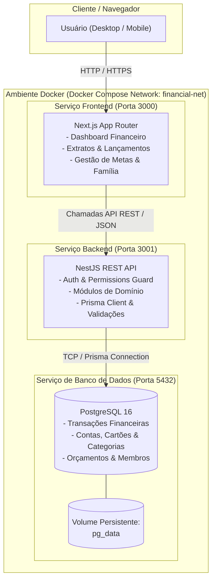

# Documento de Arquitetura e Stack Tecnológica - Sistema Financeiro

## 1. Visão Geral da Arquitetura

O **Sistema Financeiro Pessoal e Familiar** adota uma arquitetura **Cliente-Servidor desacoplada (Decoupled Client-Server)** com backend baseado em **Monolito Modular**, garantindo alta manutenibilidade, separação clara de responsabilidades e facilidade de implantação através de **Containers Docker**.

### Diretrizes Arquiteturais Principais:
- **Full-Stack JavaScript/TypeScript**: Unificação da linguagem em todo o ecossistema, proporcionando compartilhamento de tipos (DTOs/Interfaces) e facilidade de manutenção.
- **Isolamento e Portabilidade**: Todo o ambiente de desenvolvimento e produção é executado em containers Docker via Docker Compose.
- **Precisão Financeira**: Armazenamento estrito de valores monetários com tipos decimais/inteiros de centavos, prevenindo erros de ponto flutuante.
- **Multiusuário e Contexto Familiar**: Suporte a dados individuais (pessoais) e consolidados (família/grupo familiar) através de controle de acesso refinado (RBAC).

---

## 2. Stack Tecnológica

| Camada | Tecnologia | Justificativa Técnica |
| :--- | :--- | :--- |
| **Linguagem / Runtime** | **TypeScript / Node.js (v20+ LTS)** | Tipagem estática robusta, segurança em tempo de compilação e alta produtividade. |
| **Backend API** | **NestJS** | Framework corporativo estruturado em módulos, com injeção de dependências, validações automáticas (`class-validator`), Guards de segurança e suporte nativo ao Swagger/OpenAPI. |
| **Frontend Web** | **Next.js 14+ (App Router)** | Renderização híbrida (SSR / Client Components), performance otimizada, Server Actions e ecossistema moderno de componentes. |
| **Estilização & UI** | **Tailwind CSS + Shadcn UI** | Componentes acessíveis, responsivos, altamente customizáveis e prontos para dashboards financeiros modernos. |
| **Gráficos & Visualização** | **Recharts / Chart.js** | Visualização interativa de fluxo de caixa, despesas por categoria, projeções de metas e evolução patrimonial. |
| **Banco de Dados** | **PostgreSQL 16+** | Banco relacional robusto com total conformidade ACID, essencial para integridade de transações financeiras, suporte a índices eficientes e campos JSONB. |
| **ORM / Migrations** | **Prisma ORM** | Schema declarativo, migrations tipadas e seguras, e cliente de consulta com autocompletar e tipagem estrita no TypeScript. |
| **Ambiente & Container** | **Docker & Docker Compose** | Padronização do ambiente de desenvolvimento e produção, garantindo paridade total entre ambientes e inicialização rápida de serviços (`api`, `web`, `db`). |
| **Autenticação** | **JWT + Passport.js (NestJS)** | Sessões stateless seguras com tokens de acesso e refresh tokens, compatíveis com web e futuros apps mobile. |

---

## 3. Diagrama de Arquitetura



---

## 4. Estrutura Modular do Backend (NestJS)

A API é dividida em módulos independentes seguindo os princípios de *Clean Architecture* e *Domain-Driven Design*:

```
src/
├── app.module.ts
├── common/                   # Filtros globais, interceptors, decorators, guards
├── config/                   # Configuração de variáveis de ambiente
├── modules/
│   ├── auth/                 # Registro, Login, JWT Strategy, Refresh Token
│   ├── users/                # Gestão de usuários e perfis individuais
│   ├── families/             # Gestão de grupos familiares, convites e permissões
│   ├── accounts/             # Contas bancárias, carteiras físicas e cartões de crédito
│   ├── categories/           # Categorias e subcategorias (receitas/despesas)
│   ├── transactions/         # Receitas, despesas, transferências, parcelamentos e recorrências
│   ├── budgets/              # Orçamentos mensais e limites por categoria
│   ├── goals/                # Metas de economia, reservas e evolução de aportes
│   └── reports/              # Métricas, fluxo de caixa, consolidado familiar e exportação
└── prisma/                   # Schema do banco, migrations e seeds
```

---

## 5. Modelagem e Regras para Dados Financeiros

1. **Armazenamento Monetário Seguro**:
   - Evitar `FLOAT` ou `DOUBLE`.
   - Utilizar o tipo `NUMERIC(15, 2)` no PostgreSQL ou armazenar os valores em centavos (`BIGINT`) para garantir precisão exata nas operações aritméticas.
2. **Contexto Familiar vs. Pessoal**:
   - Toda transação pertence a um `userId` (autor do lançamento) e pode estar vinculada a um `familyId` (se for compartilhada com o grupo familiar) ou marcada como `isPrivate: true`.
3. **Tipos de Lançamento Suportados**:
   - `INCOME` (Receita)
   - `EXPENSE` (Despesa)
   - `TRANSFER` (Transferência entre contas)
4. **Controle de Recorrências e Parcelamentos**:
   - Suporte a transações fixas/mensais e geração de parcelas indexadas (ex: `1/12`, `2/12`).

---

## 6. Configuração do Ambiente Docker (Docker Compose)

O arquivo `docker-compose.yml` orquestra todos os serviços necessários:

```yaml
version: '3.8'

services:
  # Banco de Dados PostgreSQL
  postgres:
    image: postgres:16-alpine
    container_name: financial_postgres
    restart: always
    environment:
      POSTGRES_USER: ${DB_USER:-postgres}
      POSTGRES_PASSWORD: ${DB_PASSWORD:-postgres}
      POSTGRES_DB: ${DB_NAME:-financial_db}
    ports:
      - "5432:5432"
    volumes:
      - postgres_data:/var/lib/postgresql/data
    networks:
      - financial-net
    healthcheck:
      test: ["CMD-SHELL", "pg_isready -U ${DB_USER:-postgres} -d ${DB_NAME:-financial_db}"]
      interval: 5s
      timeout: 5s
      retries: 5

  # Backend NestJS
  api:
    build:
      context: ./backend
      dockerfile: Dockerfile
    container_name: financial_api
    restart: always
    depends_on:
      postgres:
        condition: service_healthy
    environment:
      NODE_ENV: development
      PORT: 3001
      DATABASE_URL: postgresql://${DB_USER:-postgres}:${DB_PASSWORD:-postgres}@postgres:5432/${DB_NAME:-financial_db}?schema=public
      JWT_SECRET: ${JWT_SECRET:-supersecretjwtkey}
      JWT_EXPIRATION: 1d
    ports:
      - "3001:3001"
    volumes:
      - ./backend:/app
      - /app/node_modules
    networks:
      - financial-net

  # Frontend Next.js
  frontend:
    build:
      context: ./frontend
      dockerfile: Dockerfile
    container_name: financial_frontend
    restart: always
    depends_on:
      - api
    environment:
      NODE_ENV: development
      NEXT_PUBLIC_API_URL: http://localhost:3001
    ports:
      - "3000:3000"
    volumes:
      - ./frontend:/app
      - /app/node_modules
      - /app/.next
    networks:
      - financial-net

volumes:
  postgres_data:
    driver: local

networks:
  financial-net:
    driver: bridge
```

---

## 7. Próximos Passos de Implementação

- [ ] Configuração do repositório inicial (monorepo ou repositórios separados para frontend/backend).
- [ ] Criação dos `Dockerfiles` otimizados para Next.js e NestJS.
- [ ] Definição do schema completo do Prisma com as entidades: `User`, `Family`, `Account`, `Category`, `Transaction`, `Budget` e `Goal`.
- [ ] Implementação do módulo de autenticação e configuração inicial do dashboard no Next.js.
