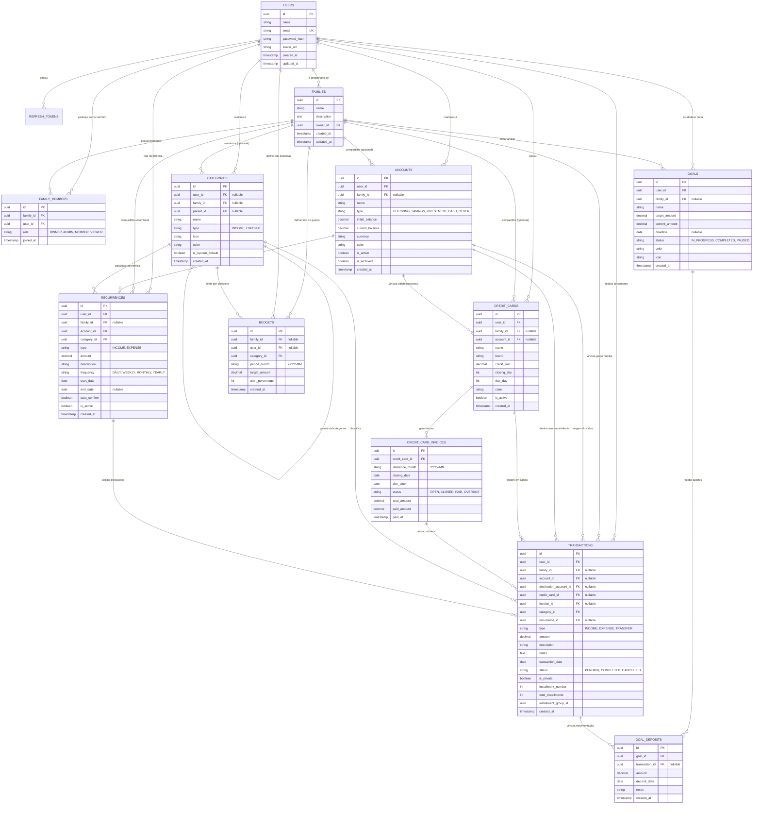

# Modelagem do Banco de Dados Relacional (PostgreSQL) - Sistema Financeiro

Este documento especifica a modelagem relacional do banco de dados para o **Sistema Financeiro Pessoal e Familiar**, projetado para **PostgreSQL 16+** e mapeado com **Prisma ORM**.

O modelo foi desenhado para atender aos fluxos de finanças individuais (visão do usuário) e coletivas (visão familiar compartilhada), garantindo **precisão monetária**, integridade referencial estrita e alta performance em consultas de relatórios e extratos.

---

## 1. Diagrama de Entidade e Relacionamento (ERD)



---

## 2. Tipos Enumerados (Enums)

Para manter a consistência e integridade dos estados:

```sql
-- Papéis de membros na família
CREATE TYPE family_member_role AS ENUM ('OWNER', 'ADMIN', 'MEMBER', 'VIEWER');

-- Tipos de contas bancárias e carteiras
CREATE TYPE account_type AS ENUM ('CHECKING', 'SAVINGS', 'INVESTMENT', 'CASH', 'OTHER');

-- Status de faturas de cartão
CREATE TYPE invoice_status AS ENUM ('OPEN', 'CLOSED', 'PAID', 'OVERDUE');

-- Tipos de movimentação / categoria
CREATE TYPE transaction_type AS ENUM ('INCOME', 'EXPENSE', 'TRANSFER');

-- Status de efetivação da transação
CREATE TYPE transaction_status AS ENUM ('PENDING', 'COMPLETED', 'CANCELLED');

-- Frequência de recorrências
CREATE TYPE recurrence_frequency AS ENUM ('DAILY', 'WEEKLY', 'MONTHLY', 'YEARLY');

-- Status de metas financeiras
CREATE TYPE goal_status AS ENUM ('IN_PROGRESS', 'COMPLETED', 'PAUSED');
```

---

## 3. Dicionário de Dados Detalhado

### 3.1. Tabela: `users` (Usuários do Sistema)
Armazena os dados cadastrais e credenciais de acesso de cada usuário.

| Coluna | Tipo | Nulo? | Padrão | Descrição |
| :--- | :--- | :--- | :--- | :--- |
| `id` | `UUID` | **NÃO** | `gen_random_uuid()` | Chave Primária |
| `name` | `VARCHAR(150)` | **NÃO** | - | Nome completo do usuário |
| `email` | `VARCHAR(255)` | **NÃO** | - | Email único para autenticação |
| `password_hash` | `VARCHAR(255)` | **NÃO** | - | Hash bcrypt/argon2 da senha |
| `avatar_url` | `TEXT` | SIM | `NULL` | Link para foto de perfil |
| `created_at` | `TIMESTAMPTZ` | **NÃO** | `NOW()` | Data/hora de cadastro |
| `updated_at` | `TIMESTAMPTZ` | **NÃO** | `NOW()` | Data/hora de última alteração |

---

### 3.2. Tabela: `families` & `family_members` (Grupos Familiares)
Permite que múltiplos usuários compartilhem contas, orçamentos e relatórios consolidados.

#### `families`
| Coluna | Tipo | Nulo? | Padrão | Descrição |
| :--- | :--- | :--- | :--- | :--- |
| `id` | `UUID` | **NÃO** | `gen_random_uuid()` | Chave Primária |
| `name` | `VARCHAR(100)` | **NÃO** | - | Nome do grupo (ex: "Família Silva") |
| `description` | `TEXT` | SIM | `NULL` | Descrição ou observações |
| `owner_id` | `UUID` | **NÃO** | - | FK `users(id)` (Criador/Administrador principal) |
| `created_at` | `TIMESTAMPTZ` | **NÃO** | `NOW()` | Data de criação |
| `updated_at` | `TIMESTAMPTZ` | **NÃO** | `NOW()` | Data de alteração |

#### `family_members`
| Coluna | Tipo | Nulo? | Padrão | Descrição |
| :--- | :--- | :--- | :--- | :--- |
| `id` | `UUID` | **NÃO** | `gen_random_uuid()` | Chave Primária |
| `family_id` | `UUID` | **NÃO** | - | FK `families(id)` ON DELETE CASCADE |
| `user_id` | `UUID` | **NÃO** | - | FK `users(id)` ON DELETE CASCADE |
| `role` | `family_member_role` | **NÃO** | `'MEMBER'` | Permissão no grupo (`OWNER`, `ADMIN`, `MEMBER`, `VIEWER`) |
| `joined_at` | `TIMESTAMPTZ` | **NÃO** | `NOW()` | Data de entrada no grupo |

*Restrição de Unicidade*: `UNIQUE(family_id, user_id)`

---

### 3.3. Tabela: `accounts` (Contas Bancárias e Carteiras)
Controla os saldos de contas correntes, poupanças, investimentos e dinheiro em espécie.

| Coluna | Tipo | Nulo? | Padrão | Descrição |
| :--- | :--- | :--- | :--- | :--- |
| `id` | `UUID` | **NÃO** | `gen_random_uuid()` | Chave Primária |
| `user_id` | `UUID` | **NÃO** | - | FK `users(id)` (Responsável pela conta) |
| `family_id` | `UUID` | SIM | `NULL` | FK `families(id)` (Preenchido se for conta familiar) |
| `name` | `VARCHAR(100)` | **NÃO** | - | Nome identificador (ex: "Nubank Conta", "Carteira") |
| `type` | `account_type` | **NÃO** | `'CHECKING'` | Tipo da conta |
| `initial_balance` | `NUMERIC(15, 2)`| **NÃO** | `0.00` | Saldo inicial cadastrado |
| `current_balance` | `NUMERIC(15, 2)`| **NÃO** | `0.00` | Saldo atualizado após movimentações |
| `currency` | `VARCHAR(3)` | **NÃO** | `'BRL'` | Código da moeda (ISO 4217) |
| `color` | `VARCHAR(7)` | SIM | `NULL` | Código Hexadecimal de cor para a UI |
| `icon` | `VARCHAR(50)` | SIM | `NULL` | Identificador do ícone Lucide |
| `is_active` | `BOOLEAN` | **NÃO** | `TRUE` | Indica se a conta está ativa |
| `is_archived` | `BOOLEAN` | **NÃO** | `FALSE` | Oculta da visualização sem apagar histórico |
| `created_at` | `TIMESTAMPTZ` | **NÃO** | `NOW()` | Data de criação |
| `updated_at` | `TIMESTAMPTZ` | **NÃO** | `NOW()` | Data de alteração |

---

### 3.4. Tabelas: `credit_cards` & `credit_card_invoices` (Cartões de Crédito e Faturas)

#### `credit_cards`
| Coluna | Tipo | Nulo? | Padrão | Descrição |
| :--- | :--- | :--- | :--- | :--- |
| `id` | `UUID` | **NÃO** | `gen_random_uuid()` | Chave Primária |
| `user_id` | `UUID` | **NÃO** | - | FK `users(id)` |
| `family_id` | `UUID` | SIM | `NULL` | FK `families(id)` (Se compartilhado) |
| `account_id` | `UUID` | SIM | `NULL` | FK `accounts(id)` (Conta vinculada para débito automático) |
| `name` | `VARCHAR(100)` | **NÃO** | - | Ex: "Nubank Mastercard Black" |
| `brand` | `VARCHAR(50)` | SIM | `NULL` | Bandeira (Visa, Mastercard, Elo, etc.) |
| `credit_limit` | `NUMERIC(15, 2)`| **NÃO** | `0.00` | Limite total do cartão |
| `closing_day` | `SMALLINT` | **NÃO** | - | Dia de fechamento da fatura (1 a 31) |
| `due_day` | `SMALLINT` | **NÃO** | - | Dia de vencimento da fatura (1 a 31) |
| `color` | `VARCHAR(7)` | SIM | `NULL` | Cor para exibição |
| `is_active` | `BOOLEAN` | **NÃO** | `TRUE` | Status do cartão |
| `created_at` | `TIMESTAMPTZ` | **NÃO** | `NOW()` | Data de cadastro |
| `updated_at` | `TIMESTAMPTZ` | **NÃO** | `NOW()` | Data de atualização |

#### `credit_card_invoices`
| Coluna | Tipo | Nulo? | Padrão | Descrição |
| :--- | :--- | :--- | :--- | :--- |
| `id` | `UUID` | **NÃO** | `gen_random_uuid()` | Chave Primária |
| `credit_card_id` | `UUID` | **NÃO** | - | FK `credit_cards(id)` ON DELETE CASCADE |
| `reference_month`| `VARCHAR(7)` | **NÃO** | - | Mês de referência no formato `YYYY-MM` |
| `closing_date` | `DATE` | **NÃO** | - | Data exata de fechamento |
| `due_date` | `DATE` | **NÃO** | - | Data exata de vencimento |
| `status` | `invoice_status` | **NÃO**| `'OPEN'` | Status da fatura |
| `total_amount` | `NUMERIC(15, 2)`| **NÃO** | `0.00` | Valor total consolidado da fatura |
| `paid_amount` | `NUMERIC(15, 2)`| **NÃO** | `0.00` | Valor já pago |
| `paid_at` | `TIMESTAMPTZ` | SIM | `NULL` | Data/hora do pagamento |

---

### 3.5. Tabela: `categories` (Categorias e Subcategorias)
Classificação de receitas e despesas com suporte a hierarquia (árvore de categorias).

| Coluna | Tipo | Nulo? | Padrão | Descrição |
| :--- | :--- | :--- | :--- | :--- |
| `id` | `UUID` | **NÃO** | `gen_random_uuid()` | Chave Primária |
| `user_id` | `UUID` | SIM | `NULL` | FK `users(id)` (NULL se for categoria padrão do sistema) |
| `family_id` | `UUID` | SIM | `NULL` | FK `families(id)` (Se customizada pelo grupo) |
| `parent_id` | `UUID` | SIM | `NULL` | FK `categories(id)` (Auto-relacionamento para subcategorias) |
| `name` | `VARCHAR(100)` | **NÃO** | - | Nome da categoria (ex: "Alimentação", "Supermercado") |
| `type` | `transaction_type`| **NÃO**| `'EXPENSE'` | `INCOME` ou `EXPENSE` |
| `icon` | `VARCHAR(50)` | SIM | `NULL` | Nome do ícone da UI |
| `color` | `VARCHAR(7)` | SIM | `NULL` | Cor representativa |
| `is_system_default`|`BOOLEAN` | **NÃO** | `FALSE` | Indica categoria predefinida do sistema |
| `created_at` | `TIMESTAMPTZ` | **NÃO** | `NOW()` | Data de criação |

---

### 3.6. Tabela: `transactions` (Lançamentos e Movimentações)
Tabela central de registros de receitas, despesas, transferências, compras parceladas e transações de cartão.

| Coluna | Tipo | Nulo? | Padrão | Descrição |
| :--- | :--- | :--- | :--- | :--- |
| `id` | `UUID` | **NÃO** | `gen_random_uuid()` | Chave Primária |
| `user_id` | `UUID` | **NÃO** | - | FK `users(id)` (Autor do lançamento) |
| `family_id` | `UUID` | SIM | `NULL` | FK `families(id)` (Vínculo familiar se compartilhado) |
| `account_id` | `UUID` | SIM | `NULL` | FK `accounts(id)` (Conta de débito/crédito) |
| `destination_account_id` | `UUID` | SIM | `NULL` | FK `accounts(id)` (Preenchido apenas em `TRANSFER`) |
| `credit_card_id` | `UUID` | SIM | `NULL` | FK `credit_cards(id)` (Se compra no cartão de crédito) |
| `invoice_id` | `UUID` | SIM | `NULL` | FK `credit_card_invoices(id)` (Fatura correspondente) |
| `category_id` | `UUID` | **NÃO** | - | FK `categories(id)` |
| `recurrence_id` | `UUID` | SIM | `NULL` | FK `recurrences(id)` (Se gerado por recorrência) |
| `type` | `transaction_type`| **NÃO**| - | `INCOME`, `EXPENSE` ou `TRANSFER` |
| `amount` | `NUMERIC(15, 2)`| **NÃO** | - | Valor positivo da movimentação |
| `description` | `VARCHAR(255)` | **NÃO** | - | Descrição do lançamento (ex: "Compra Supermercado") |
| `notes` | `TEXT` | SIM | `NULL` | Observações adicionais |
| `transaction_date`| `DATE` | **NÃO** | - | Data da realização do gasto/recebimento |
| `status` | `transaction_status`| **NÃO**| `'COMPLETED'` | `PENDING`, `COMPLETED` ou `CANCELLED` |
| `is_private` | `BOOLEAN` | **NÃO** | `FALSE` | Se TRUE, visível apenas pelo autor mesmo no grupo |
| `installment_number` | `SMALLINT`| SIM | `NULL` | Número da parcela atual (ex: 1) |
| `total_installments` | `SMALLINT`| SIM | `NULL` | Total de parcelas (ex: 12) |
| `installment_group_id` | `UUID` | SIM | `NULL` | UUID comum para agrupar todas as parcelas da compra |
| `created_at` | `TIMESTAMPTZ` | **NÃO** | `NOW()` | Registro no banco |
| `updated_at` | `TIMESTAMPTZ` | **NÃO** | `NOW()` | Última atualização |

---

### 3.7. Tabela: `budgets` (Orçamentos e Tetos de Gastos)
Controla limites de despesa por categoria e período (mensal).

| Coluna | Tipo | Nulo? | Padrão | Descrição |
| :--- | :--- | :--- | :--- | :--- |
| `id` | `UUID` | **NÃO** | `gen_random_uuid()` | Chave Primária |
| `family_id` | `UUID` | SIM | `NULL` | FK `families(id)` (Orçamento familiar compartilhado) |
| `user_id` | `UUID` | SIM | `NULL` | FK `users(id)` (Orçamento individual) |
| `category_id` | `UUID` | **NÃO** | - | FK `categories(id)` |
| `period_month` | `VARCHAR(7)` | **NÃO** | - | Mês no formato `YYYY-MM` |
| `target_amount` | `NUMERIC(15, 2)`| **NÃO** | - | Limite máximo planejado de gastos |
| `alert_percentage`| `SMALLINT`| **NÃO** | `80` | Porcentagem para disparar alerta de proximidade |
| `created_at` | `TIMESTAMPTZ` | **NÃO** | `NOW()` | Data de criação |

---

### 3.8. Tabelas: `goals` & `goal_deposits` (Metas Financeiras e Reservas)

#### `goals`
| Coluna | Tipo | Nulo? | Padrão | Descrição |
| :--- | :--- | :--- | :--- | :--- |
| `id` | `UUID` | **NÃO** | `gen_random_uuid()` | Chave Primária |
| `user_id` | `UUID` | **NÃO** | - | FK `users(id)` |
| `family_id` | `UUID` | SIM | `NULL` | FK `families(id)` (Meta familiar) |
| `name` | `VARCHAR(150)` | **NÃO** | - | Nome da meta (ex: "Reserva de Emergência") |
| `target_amount` | `NUMERIC(15, 2)`| **NÃO** | - | Valor objetivo final |
| `current_amount`| `NUMERIC(15, 2)`| **NÃO** | `0.00` | Valor acumulado até o momento |
| `deadline` | `DATE` | SIM | `NULL` | Prazo planejado |
| `status` | `goal_status` | **NÃO** | `'IN_PROGRESS'` | `IN_PROGRESS`, `COMPLETED`, `PAUSED` |
| `color` | `VARCHAR(7)` | SIM | `NULL` | Cor representativa |
| `icon` | `VARCHAR(50)` | SIM | `NULL` | Ícone para exibição |
| `created_at` | `TIMESTAMPTZ` | **NÃO** | `NOW()` | Data de criação |

#### `goal_deposits`
| Coluna | Tipo | Nulo? | Padrão | Descrição |
| :--- | :--- | :--- | :--- | :--- |
| `id` | `UUID` | **NÃO** | `gen_random_uuid()` | Chave Primária |
| `goal_id` | `UUID` | **NÃO** | - | FK `goals(id)` ON DELETE CASCADE |
| `transaction_id`| `UUID` | SIM | `NULL` | FK `transactions(id)` (Transação de débito vinculada) |
| `amount` | `NUMERIC(15, 2)`| **NÃO** | - | Valor do aporte / resgate |
| `deposit_date` | `DATE` | **NÃO** | - | Data da movimentação na meta |
| `notes` | `TEXT` | SIM | `NULL` | Observações |
| `created_at` | `TIMESTAMPTZ` | **NÃO** | `NOW()` | Registro |

---

## 4. Índices Estratégicos de Performance

Para garantir respostas sub-milissegundo em relatórios, listagens de extrato e filtros:

```sql
-- Índices para busca rápida de lançamentos por usuário e período
CREATE INDEX idx_transactions_user_date ON transactions (user_id, transaction_date DESC);
CREATE INDEX idx_transactions_family_date ON transactions (family_id, transaction_date DESC) WHERE family_id IS NOT NULL;

-- Índice para consultas de extrato por conta bancária
CREATE INDEX idx_transactions_account_date ON transactions (account_id, transaction_date DESC);

-- Índice para conferência de faturas de cartão
CREATE INDEX idx_transactions_invoice ON transactions (invoice_id) WHERE invoice_id IS NOT NULL;

-- Índice para relatórios agrupados por categoria e data
CREATE INDEX idx_transactions_category_date ON transactions (category_id, transaction_date);

-- Índice de faturas por cartão e mês de referência
CREATE UNIQUE INDEX uq_invoice_card_month ON credit_card_invoices (credit_card_id, reference_month);

-- Índice de orçamentos por período e categoria
CREATE UNIQUE INDEX uq_budget_family_cat_month ON budgets (family_id, category_id, period_month) WHERE family_id IS NOT NULL;
CREATE UNIQUE INDEX uq_budget_user_cat_month ON budgets (user_id, category_id, period_month) WHERE user_id IS NOT NULL AND family_id IS NULL;
```

---

## 5. Schema Declarativo Prisma (`schema.prisma`)

Abaixo está a definição correspondente para uso direto com o Prisma ORM no NestJS:

```prisma
datasource db {
  provider = "postgresql"
  url      = env("DATABASE_URL")
}

generator client {
  provider = "prisma-client-js"
}

enum FamilyMemberRole {
  OWNER
  ADMIN
  MEMBER
  VIEWER
}

enum AccountType {
  CHECKING
  SAVINGS
  INVESTMENT
  CASH
  OTHER
}

enum InvoiceStatus {
  OPEN
  CLOSED
  PAID
  OVERDUE
}

enum TransactionType {
  INCOME
  EXPENSE
  TRANSFER
}

enum TransactionStatus {
  PENDING
  COMPLETED
  CANCELLED
}

enum RecurrenceFrequency {
  DAILY
  WEEKLY
  MONTHLY
  YEARLY
}

enum GoalStatus {
  IN_PROGRESS
  COMPLETED
  PAUSED
}

model User {
  id            String          @id @default(uuid()) @db.Uuid
  name          String          @db.VarChar(150)
  email         String          @unique @db.VarChar(255)
  passwordHash  String          @map("password_hash") @db.VarChar(255)
  avatarUrl     String?         @map("avatar_url") @db.Text
  createdAt     DateTime        @default(now()) @map("created_at") @db.Timestamptz
  updatedAt     DateTime        @updatedAt @map("updated_at") @db.Timestamptz

  ownedFamilies Family[]        @relation("FamilyOwner")
  memberships   FamilyMember[]
  accounts      Account[]
  creditCards   CreditCard[]
  categories    Category[]
  transactions  Transaction[]
  recurrences   Recurrence[]
  budgets       Budget[]
  goals         Goal[]

  @@map("users")
}

model Family {
  id          String         @id @default(uuid()) @db.Uuid
  name        String         @db.VarChar(100)
  description String?        @db.Text
  ownerId     String         @map("owner_id") @db.Uuid
  createdAt   DateTime       @default(now()) @map("created_at") @db.Timestamptz
  updatedAt   DateTime       @updatedAt @map("updated_at") @db.Timestamptz

  owner       User           @relation("FamilyOwner", fields: [ownerId], references: [id])
  members     FamilyMember[]
  accounts    Account[]
  creditCards CreditCard[]
  categories  Category[]
  transactions Transaction[]
  recurrences Recurrence[]
  budgets     Budget[]
  goals       Goal[]

  @@map("families")
}

model FamilyMember {
  id        String           @id @default(uuid()) @db.Uuid
  familyId  String           @map("family_id") @db.Uuid
  userId    String           @map("user_id") @db.Uuid
  role      FamilyMemberRole @default(MEMBER)
  joinedAt  DateTime         @default(now()) @map("joined_at") @db.Timestamptz

  family    Family           @relation(fields: [familyId], references: [id], onDelete: Cascade)
  user      User             @relation(fields: [userId], references: [id], onDelete: Cascade)

  @@unique([familyId, userId])
  @@map("family_members")
}

model Account {
  id             String        @id @default(uuid()) @db.Uuid
  userId         String        @map("user_id") @db.Uuid
  familyId       String?       @map("family_id") @db.Uuid
  name           String        @db.VarChar(100)
  type           AccountType   @default(CHECKING)
  initialBalance Decimal       @default(0.00) @map("initial_balance") @db.Decimal(15, 2)
  currentBalance Decimal       @default(0.00) @map("current_balance") @db.Decimal(15, 2)
  currency       String        @default("BRL") @db.VarChar(3)
  color          String?       @db.VarChar(7)
  icon           String?       @db.VarChar(50)
  isActive       Boolean       @default(true) @map("is_active")
  isArchived     Boolean       @default(false) @map("is_archived")
  createdAt      DateTime      @default(now()) @map("created_at") @db.Timestamptz
  updatedAt      DateTime      @updatedAt @map("updated_at") @db.Timestamptz

  user           User          @relation(fields: [userId], references: [id], onDelete: Cascade)
  family         Family?       @relation(fields: [familyId], references: [id], onDelete: SetNull)
  creditCards    CreditCard[]
  transactions   Transaction[] @relation("SourceAccount")
  destTransfers  Transaction[] @relation("DestAccount")
  recurrences    Recurrence[]

  @@map("accounts")
}

model CreditCard {
  id           String              @id @default(uuid()) @db.Uuid
  userId       String              @map("user_id") @db.Uuid
  familyId     String?             @map("family_id") @db.Uuid
  accountId    String?             @map("account_id") @db.Uuid
  name         String              @db.VarChar(100)
  brand        String?             @db.VarChar(50)
  creditLimit  Decimal             @default(0.00) @map("credit_limit") @db.Decimal(15, 2)
  closingDay   Int                 @map("closing_day") @db.SmallInt
  dueDay       Int                 @map("due_day") @db.SmallInt
  color        String?             @db.VarChar(7)
  isActive     Boolean             @default(true) @map("is_active")
  createdAt    DateTime            @default(now()) @map("created_at") @db.Timestamptz
  updatedAt    DateTime            @updatedAt @map("updated_at") @db.Timestamptz

  user         User                @relation(fields: [userId], references: [id], onDelete: Cascade)
  family       Family?             @relation(fields: [familyId], references: [id], onDelete: SetNull)
  account      Account?            @relation(fields: [accountId], references: [id], onDelete: SetNull)
  invoices     CreditCardInvoice[]
  transactions Transaction[]

  @@map("credit_cards")
}

model CreditCardInvoice {
  id             String        @id @default(uuid()) @db.Uuid
  creditCardId   String        @map("credit_card_id") @db.Uuid
  referenceMonth String        @map("reference_month") @db.VarChar(7)
  closingDate    DateTime      @map("closing_date") @db.Date
  dueDate        DateTime      @map("due_date") @db.Date
  status         InvoiceStatus @default(OPEN)
  totalAmount    Decimal       @default(0.00) @map("total_amount") @db.Decimal(15, 2)
  paidAmount     Decimal       @default(0.00) @map("paid_amount") @db.Decimal(15, 2)
  paidAt         DateTime?     @map("paid_at") @db.Timestamptz

  creditCard     CreditCard    @relation(fields: [creditCardId], references: [id], onDelete: Cascade)
  transactions   Transaction[]

  @@unique([creditCardId, referenceMonth])
  @@map("credit_card_invoices")
}

model Category {
  id              String          @id @default(uuid()) @db.Uuid
  userId          String?         @map("user_id") @db.Uuid
  familyId        String?         @map("family_id") @db.Uuid
  parentId        String?         @map("parent_id") @db.Uuid
  name            String          @db.VarChar(100)
  type            TransactionType @default(EXPENSE)
  icon            String?         @db.VarChar(50)
  color           String?         @db.VarChar(7)
  isSystemDefault Boolean         @default(false) @map("is_system_default")
  createdAt       DateTime        @default(now()) @map("created_at") @db.Timestamptz

  user            User?           @relation(fields: [userId], references: [id], onDelete: Cascade)
  family          Family?         @relation(fields: [familyId], references: [id], onDelete: Cascade)
  parent          Category?       @relation("CategoryHierarchy", fields: [parentId], references: [id], onDelete: Cascade)
  subcategories   Category[]      @relation("CategoryHierarchy")
  transactions    Transaction[]
  recurrences     Recurrence[]
  budgets         Budget[]

  @@map("categories")
}

model Transaction {
  id                   String            @id @default(uuid()) @db.Uuid
  userId               String            @map("user_id") @db.Uuid
  familyId             String?           @map("family_id") @db.Uuid
  accountId            String?           @map("account_id") @db.Uuid
  destinationAccountId String?           @map("destination_account_id") @db.Uuid
  creditCardId         String?           @map("credit_card_id") @db.Uuid
  invoiceId            String?           @map("invoice_id") @db.Uuid
  categoryId           String            @map("category_id") @db.Uuid
  recurrenceId         String?           @map("recurrence_id") @db.Uuid
  type                 TransactionType
  amount               Decimal           @db.Decimal(15, 2)
  description          String            @db.VarChar(255)
  notes                String?           @db.Text
  transactionDate      DateTime          @map("transaction_date") @db.Date
  status               TransactionStatus @default(COMPLETED)
  isPrivate            Boolean           @default(false) @map("is_private")
  installmentNumber    Int?              @map("installment_number") @db.SmallInt
  totalInstallments    Int?              @map("total_installments") @db.SmallInt
  installmentGroupId   String?           @map("installment_group_id") @db.Uuid
  createdAt            DateTime          @default(now()) @map("created_at") @db.Timestamptz
  updatedAt            DateTime          @updatedAt @map("updated_at") @db.Timestamptz

  user                 User              @relation(fields: [userId], references: [id], onDelete: Cascade)
  family               Family?           @relation(fields: [familyId], references: [id], onDelete: SetNull)
  account              Account?          @relation("SourceAccount", fields: [accountId], references: [id], onDelete: SetNull)
  destinationAccount   Account?          @relation("DestAccount", fields: [destinationAccountId], references: [id], onDelete: SetNull)
  creditCard           CreditCard?       @relation(fields: [creditCardId], references: [id], onDelete: SetNull)
  invoice              CreditCardInvoice? @relation(fields: [invoiceId], references: [id], onDelete: SetNull)
  category             Category          @relation(fields: [categoryId], references: [id], onDelete: Restrict)
  recurrence           Recurrence?       @relation(fields: [recurrenceId], references: [id], onDelete: SetNull)
  goalDeposits         GoalDeposit[]

  @@index([userId, transactionDate])
  @@index([familyId, transactionDate])
  @@index([accountId, transactionDate])
  @@index([categoryId, transactionDate])
  @@map("transactions")
}

model Recurrence {
  id           String              @id @default(uuid()) @db.Uuid
  userId       String              @map("user_id") @db.Uuid
  familyId     String?             @map("family_id") @db.Uuid
  accountId    String              @map("account_id") @db.Uuid
  categoryId   String              @map("category_id") @db.Uuid
  type         TransactionType
  amount       Decimal             @db.Decimal(15, 2)
  description  String              @db.VarChar(255)
  frequency    RecurrenceFrequency @default(MONTHLY)
  startDate    DateTime            @map("start_date") @db.Date
  endDate      DateTime?           @map("end_date") @db.Date
  autoConfirm  Boolean             @default(false) @map("auto_confirm")
  isActive     Boolean             @default(true) @map("is_active")
  createdAt    DateTime            @default(now()) @map("created_at") @db.Timestamptz

  user         User                @relation(fields: [userId], references: [id], onDelete: Cascade)
  family       Family?             @relation(fields: [familyId], references: [id], onDelete: Cascade)
  account      Account             @relation(fields: [accountId], references: [id], onDelete: Restrict)
  category     Category            @relation(fields: [categoryId], references: [id], onDelete: Restrict)
  transactions Transaction[]

  @@map("recurrences")
}

model Budget {
  id              String    @id @default(uuid()) @db.Uuid
  familyId        String?   @map("family_id") @db.Uuid
  userId          String?   @map("user_id") @db.Uuid
  categoryId      String    @map("category_id") @db.Uuid
  periodMonth     String    @map("period_month") @db.VarChar(7)
  targetAmount    Decimal   @map("target_amount") @db.Decimal(15, 2)
  alertPercentage Int       @default(80) @map("alert_percentage") @db.SmallInt
  createdAt       DateTime  @default(now()) @map("created_at") @db.Timestamptz

  family          Family?   @relation(fields: [familyId], references: [id], onDelete: Cascade)
  user            User?     @relation(fields: [userId], references: [id], onDelete: Cascade)
  category        Category  @relation(fields: [categoryId], references: [id], onDelete: Restrict)

  @@map("budgets")
}

model Goal {
  id            String        @id @default(uuid()) @db.Uuid
  userId        String        @map("user_id") @db.Uuid
  familyId      String?       @map("family_id") @db.Uuid
  name          String        @db.VarChar(150)
  targetAmount  Decimal       @map("target_amount") @db.Decimal(15, 2)
  currentAmount Decimal       @default(0.00) @map("current_amount") @db.Decimal(15, 2)
  deadline      DateTime?     @db.Date
  status        GoalStatus    @default(IN_PROGRESS)
  color         String?       @db.VarChar(7)
  icon          String?       @db.VarChar(50)
  createdAt     DateTime      @default(now()) @map("created_at") @db.Timestamptz

  user          User          @relation(fields: [userId], references: [id], onDelete: Cascade)
  family        Family?       @relation(fields: [familyId], references: [id], onDelete: Cascade)
  deposits      GoalDeposit[]

  @@map("goals")
}

model GoalDeposit {
  id            String       @id @default(uuid()) @db.Uuid
  goalId        String       @map("goal_id") @db.Uuid
  transactionId String?      @map("transaction_id") @db.Uuid
  amount        Decimal      @db.Decimal(15, 2)
  depositDate   DateTime     @map("deposit_date") @db.Date
  notes         String?      @db.Text
  createdAt     DateTime     @default(now()) @map("created_at") @db.Timestamptz

  goal          Goal         @relation(fields: [goalId], references: [id], onDelete: Cascade)
  transaction   Transaction? @relation(fields: [transactionId], references: [id], onDelete: SetNull)

  @@map("goal_deposits")
}
```

---

## 6. Regras de Integridade e Gatilhos (Triggers / Services)

1. **Atualização Automática do Saldo da Conta (`current_balance`)**:
   - Inserção de `INCOME` (`status = COMPLETED`): incrementa `current_balance`.
   - Inserção de `EXPENSE` (`status = COMPLETED`): decrementa `current_balance`.
   - Inserção de `TRANSFER` (`status = COMPLETED`): debita de `account_id` e credita em `destination_account_id`.
   - Se uma transação passar para `CANCELLED`, o saldo é revertido proporcionalmente.

2. **Fechamento e Consolidação de Faturas de Cartão**:
   - Transações de cartão de crédito não abatem saldo imediato da conta bancária; elas acumulam no `total_amount` da `credit_card_invoices` aberta correspondente ao mês.
   - O pagamento da fatura (`status = PAID`) gera uma transação de despesa na conta bancária de liquidação.

3. **Imutabilidade e Precisão**:
   - Todo campo financeiro utiliza `DECIMAL(15, 2)` para eliminar erros de precisão decimal de ponto flutuante.
